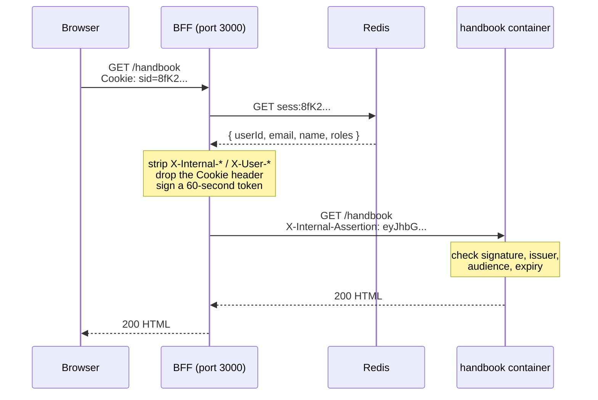

# BFF starter

This is a web app split into four Next.js apps that run as four containers. One
of them — the **BFF** — is the only one the browser can reach; it handles logging
in and holds the session. The other three are ordinary feature apps that sit
behind it and are only reachable through it.

The reason for the split is that login tokens stay on the server. The browser
never receives one, so there is no token sitting in `localStorage` for a
malicious script to find.

New to this pattern? Read **[docs/architecture.mdx](docs/architecture.mdx)** —
it explains why this exists instead of a normal single-page app, in plain
language and without assuming you know anything about OIDC.

---

## Quick start

You need [Docker Desktop](https://www.docker.com/products/docker-desktop/) (or
Docker Engine with Compose v2) and Node 20.

```bash
npm install

# Windows PowerShell: Copy-Item .env.example .env
cp .env.example .env

docker compose up --build
```

First build takes a few minutes. When it settles you'll see four services
running. Open <http://localhost:3000>.

**What you should see:**

1. A page titled **BFF** that says *Not signed in*, with a **Sign in** button and
   links to Connect, IIF and Handbook.
2. Click **Sign in**. Because `AUTH_MODE=stub`, you get a local page listing
   three made-up users — Ada Lovelace, Grace Hopper, Alan Turing — each with a
   different set of roles. There is no password and no identity provider
   involved. Click one.
3. You're back on the home page, now showing that user's name, email, id and
   roles.
4. Click **Handbook**. You land on a page inside a *different container*, which
   shows the same name, email and roles — plus the raw claims it verified.

That last step is the thing worth checking. The Handbook container has no access
to your cookie and no connection to Redis. It knows who you are only because the
BFF vouched for you, in a signed token that expires in 60 seconds. If the name
and roles on the Handbook page match who you signed in as, the whole chain works.

Useful commands while it's running:

```bash
curl http://localhost:3000/api/health      # is the BFF up
curl http://localhost:3000/api/auth/me     # who am I (or authenticated: false)
docker compose logs -f bff
docker compose down -v                     # stop, and drop Redis + build volumes
```

---

## The four apps

| App | Path | What it does |
| --- | --- | --- |
| **[bff](apps/bff/)** | `/` | The front door. Handles login, stores the session, adds security headers, and forwards requests to the other three. The only container with a published port. |
| **[connect](apps/connect/)** | `/connect` | People and org directory. Currently a stub page. |
| **[iif](apps/iif/)** | `/iif` | Intake form workflow. Currently a stub page. |
| **[handbook](apps/handbook/)** | `/handbook` | Policy documents. Currently a stub page. |

Plus two shared libraries:

- **[packages/internal-auth](packages/internal-auth/)** — creates and checks the
  signed token the BFF sends to the other three. Both sides import the same
  file, so they can't drift apart.
- **[packages/session-sync](packages/session-sync/)** — the sign-out button and
  the cross-tab machinery behind it, so all four apps behave identically.

Each app is a normal Next.js app. The three feature apps use Next's
[`basePath`](https://nextjs.org/docs/app/api-reference/next-config-js/basePath)
setting, which means every page and asset they serve is already prefixed with
`/connect`, `/iif` or `/handbook`. Nothing has to be rewritten in between.

---

## Following one request end to end

Say you're signed in and you click the **Handbook** link. Here is everything
that happens.



Step by step:

1. **The browser sends the request** to `http://localhost:3000/handbook`, and
   automatically attaches the `sid` cookie it was given at login. That cookie is
   32 random bytes. It contains no name, no email, no roles — nothing. It is
   just a lookup key.

2. **The BFF looks the cookie up in Redis.** The real user data is stored
   server-side under the key `sess:<sid>`. If there's no matching record — never
   logged in, signed out, or the session expired — the BFF redirects to the
   login page instead and stops here.

3. **The BFF slides the session's expiry forward.** Sessions die 30 minutes
   after the last request, and 8 hours after login no matter how active you are.
   Both clocks are enforced in Redis, not in the cookie, so they can't be
   tampered with.

4. **The BFF scrubs the request.** It deletes every incoming header starting with
   `X-Internal-` or `X-User-`. This matters: without it, anyone could send
   `X-User-Email: ceo@company.com` and the Handbook app might believe it. It
   also deletes the `Cookie` header entirely — the Handbook app has no business
   seeing your session cookie.

5. **The BFF signs a short-lived token** — a JWT, which is just a blob of JSON
   with a cryptographic signature attached. It contains the user id, email, name
   and roles. It says who issued it (`bff`), who it's *for* (`handbook`, and only
   handbook), and that it expires 60 seconds from now. It goes on the request as
   the `X-Internal-Assertion` header.

6. **The BFF forwards the request** to `http://handbook:3000/handbook` over the
   internal Docker network and streams the response back.

7. **The Handbook app checks the token** in its middleware, before any page code
   runs. Four things have to hold: the signature is valid, the issuer is `bff`,
   the audience is `handbook`, and it hasn't expired. Any failure is a flat
   `401`. A token the BFF minted for `connect` will not verify here — that's what
   the audience field is for.

8. **The page renders.** It reads the verified claims and displays them. It never
   reads identity from anywhere else.

Every request repeats this. The token is minted fresh each time and is never
cached or reused — if one leaks, it's worthless within a minute, and only for
one of the three apps.

---

## Where the tokens live

This is the part that differs from a typical single-page app, so it's worth
being precise about.

**When `AUTH_MODE=oidc`**, signing in means redirecting you to Microsoft Entra,
which sends you back with a temporary code. The BFF exchanges that code for an
**ID token** — a signed statement of who you are. That exchange happens
server-to-server. The token arrives in the BFF's memory, gets validated, and the
useful parts (id, email, name, roles) get written into Redis. Then it's
discarded.

**The browser receives exactly one thing: the `sid` cookie.** It is:

- `HttpOnly` — JavaScript cannot read it. `document.cookie` won't show it.
- `SameSite=Lax` — it isn't sent on cross-site POSTs, which blunts CSRF.
- `Secure` in production — only sent over HTTPS.
- Opaque — 32 random bytes. There is nothing in it to decode.

So there is no token in `localStorage`, no token in `sessionStorage`, no token in
a JavaScript variable, and no token in any React prop or state. A malicious
script running on the page — from a compromised npm dependency, say — has nothing
to steal. It can still *make requests* as you while you have the page open,
because the browser attaches the cookie automatically. But it cannot extract a
credential and replay it later from somewhere else.

That distinction is the actual benefit, and it's a real one, but it is narrower
than "this prevents XSS". [docs/architecture.mdx](docs/architecture.mdx) covers
it properly.

**The internal assertion** — the 60-second token from step 5 — also never
reaches the browser. It's added to the outgoing request inside the BFF
container and only travels over the internal Docker network.

---

## Signing out

The **Sign out** button is in the header of every app. Pressing it:

1. Tells other tabs, over a
   [`BroadcastChannel`](https://developer.mozilla.org/en-US/docs/Web/API/BroadcastChannel),
   that you're signing out.
2. POSTs to `/api/auth/logout`, which **deletes the session from Redis**. From
   that moment the cookie is a key to a lock that no longer exists — every
   request that still carries it, from any tab or device, is treated as signed
   out.
3. Clears the cookie and sends
   `Clear-Site-Data: "cache", "cookies", "storage"`, telling the browser to drop
   everything it holds for this origin. That header is sent on this one route
   and nowhere else.
4. Redirects to `/api/auth/logged-out`, a public page that does no session
   lookup, so it renders fine for someone who has just had theirs destroyed.
   With `AUTH_MODE=oidc` it detours via Entra's sign-out endpoint first, so you
   aren't silently signed back in on the next attempt.

Meanwhile, every other tab that got the broadcast redirects itself to the same
confirmation page. **Try it:** open `/connect` and `/handbook` in two tabs, sign
out in one, and watch the other follow.

Worth being clear about what that last part is and isn't. The session is already
dead server-side the moment step 2 runs — the broadcast is only there so other
tabs stop *looking* signed in. It reaches other tabs in the same browser on the
same origin, and nothing else: not another browser, not an incognito window, not
your phone. Those sessions are dead too; they just don't know it until their
next request. Closing that gap needs a server push, which isn't built —
[`apps/bff/lib/session.ts`](apps/bff/lib/session.ts) has a TODO describing the
design.

If a sub-app is reached with a session that has since been destroyed, its
middleware redirects page loads to the confirmation page rather than showing a
bare `401`.

---

## Environment variables

Copy `.env.example` to `.env` and edit. Every variable has a working default in
`docker-compose.yml`, so an empty `.env` still boots in stub mode.

| Variable | Default | What it's for |
| --- | --- | --- |
| `BFF_PORT` | `3000` | Host port the BFF is published on. The only exposed port. |
| `AUTH_MODE` | `stub` | `stub` = local fake users, no identity provider. `oidc` = real Microsoft Entra login. |
| `SESSION_COOKIE_NAME` | `sid` | Name of the session cookie. Use `__Host-sid` in production — see below. |
| `SESSION_IDLE_SECONDS` | `1800` | Session dies this many seconds after the last request (30 min). |
| `SESSION_ABSOLUTE_SECONDS` | `28800` | Session dies this many seconds after login regardless of activity (8 h). |
| `REDIS_URL` | `redis://redis:6379` | Where sessions are stored. |
| `INTERNAL_JWT_SECRET` | dev placeholder | Shared secret used to sign and verify the internal assertion. **Change this.** |
| `INTERNAL_JWT_ISSUER` | `bff` | The `iss` value the BFF sets and the sub-apps require. |
| `INTERNAL_JWT_TTL_SECONDS` | `60` | Assertion lifetime. Don't raise it to paper over clock skew. |
| `AZURE_TENANT_ID` | *(blank)* | Entra directory (tenant) ID. Only read when `AUTH_MODE=oidc`. |
| `AZURE_CLIENT_ID` | *(blank)* | Entra application (client) ID. |
| `AZURE_CLIENT_SECRET` | *(blank)* | Entra client secret. |
| `REDIRECT_URI` | `http://localhost:3000/api/auth/callback` | Where Entra sends you back. Must match the app registration exactly. |
| `OIDC_SCOPE` | `openid profile email` | What to ask Entra for. |
| `WATCHPACK_POLLING` | `true` | Poll the filesystem for changes. Needed for hot reload on Windows and macOS bind mounts; set `false` on Linux for lower idle CPU. |

`CONNECT_ORIGIN`, `IIF_ORIGIN` and `HANDBOOK_ORIGIN` are set directly in
`docker-compose.yml` — they're container names on the internal network and
there's no reason to change them locally.

---

## Working on it

Compose bind-mounts `apps/*` and `packages/internal-auth` into the containers, so
edits hot-reload without a rebuild — including edits to the shared library.
Build output stays inside the container in a named volume rather than being
written back to your disk.

Rebuild only when a `package.json` changes:

```bash
docker compose up --build
```

This repo is **npm only** — one lockfile at the root, `npm ci` inside every
Docker build.

```bash
npm i -w @bff/bff <package>                  # add a dependency to one app
npm run build --workspace=@bff/bff           # run one app's script
npm run typecheck --workspaces --if-present  # typecheck everything
```

---

## Switching to real login

Create an app registration in Microsoft Entra, then in `.env`:

```ini
AUTH_MODE=oidc
AZURE_TENANT_ID=<directory (tenant) id>
AZURE_CLIENT_ID=<application (client) id>
AZURE_CLIENT_SECRET=<a client secret value>
REDIRECT_URI=http://localhost:3000/api/auth/callback
```

Add that same `REDIRECT_URI` to the registration's **Web** redirect URIs — it has
to match character for character. Then `docker compose up -d bff`.

`/api/auth/login` now redirects to Microsoft instead of showing the user picker.
Nothing downstream changes: both modes implement the same
[`AuthProvider`](apps/bff/lib/auth/provider.ts) interface, and no route handler
branches on `AUTH_MODE`.

---

## Before production

Four things must change. This is a local-dev scaffold.

1. **Cookie name → `__Host-sid`.** That prefix tells the browser to only accept
   the cookie if it's `Secure`, `Path=/`, and has no `Domain` — which makes it
   much harder for a subdomain to interfere with it. It requires HTTPS, so this
   and TLS land together.

2. **Certificate instead of a client secret.** Client secrets expire and end up
   in shell history. Register a certificate and switch
   [`oidc.ts`](apps/bff/lib/auth/oidc.ts) from `client_secret_post` to
   `private_key_jwt`, with the key held in Key Vault.

3. **Asymmetric internal token.** Right now the BFF and all three sub-apps share
   one secret — meaning any sub-app holds everything needed to *forge* an
   assertion for any other. Move to RS256 or ES256: the BFF signs with a private
   key, the sub-apps verify against a published public key and can't mint
   anything. The change is confined to
   [`assertion.ts`](packages/internal-auth/src/assertion.ts).

4. **A real Redis.** The dev container has no password, no TLS, and persists
   nothing. Use a managed instance, and decide what should happen to live
   sessions during a failover.

Also worth doing: put a rate limit in front of `/api/auth/login`, and add request
logging that records a *hash* of the session id rather than the id itself.

---

## Two deliberate deviations

**Proxying uses catch-all route handlers, not `next.config.js` rewrites.** A
rewrite can forward a URL, but it can't look up your session and attach a signed
token to the outgoing request. Middleware could add the header, but Next 14 runs
middleware on the Edge runtime where the Redis client can't run. So the proxy
lives in [`lib/proxy.ts`](apps/bff/lib/proxy.ts) on the Node runtime. Same URLs,
same destinations.

**Middleware runs on Edge, not Node.** Node middleware only became configurable
in Next 15. Neither middleware file needs Node APIs, so both will work unchanged
if you upgrade and turn it on.
