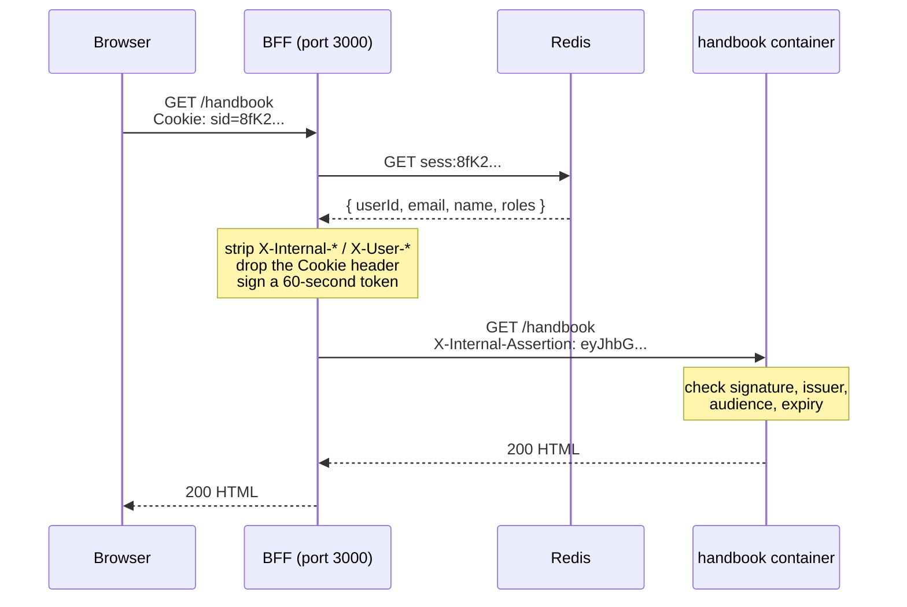

# BFF starter

This is a web app split into four Next.js apps that run as four containers. One
of them — the **BFF** — is the only one the browser can reach; it handles logging
in and holds the session. The other three are ordinary feature apps that sit
behind it and are only reachable through it.

The reason for the split is that login tokens stay on the server. The browser
never receives one, so there is no token sitting in `localStorage` for a
malicious script to find.

New to this pattern? Read **[docs/architecture.mdx](docs/architecture.mdx)** —
it explains why this exists instead of a normal single-page app, in plain
language and without assuming you know anything about OIDC.

---

## Quick start

You need [Docker Desktop](https://www.docker.com/products/docker-desktop/) (or
Docker Engine with Compose v2) and Node 22.

```bash
npm install

# Windows PowerShell: Copy-Item .env.example .env
cp .env.example .env

docker compose up --build
```

First build takes a few minutes. When it settles you'll see four services
running. Open <http://localhost:3000>.

**What you should see:**

1. A page titled **BFF** that says *Not signed in*, with a **Sign in** button and
   links to Connect, IIF and Handbook.
2. Click **Sign in**. Because `AUTH_MODE=stub`, you get a local page listing
   three made-up users — Ada Lovelace, Grace Hopper, Alan Turing — each with a
   different set of roles. There is no password and no identity provider
   involved. Click one.
3. You're back on the home page, now showing that user's name, email, id and
   roles.
4. Click **Handbook**. You land on a page inside a *different container*, which
   shows the same name, email and roles — plus the raw claims it verified.

That last step is the thing worth checking. The Handbook container has no access
to your cookie and no connection to Redis. It knows who you are only because the
BFF vouched for you, in a signed token that expires in 60 seconds. If the name
and roles on the Handbook page match who you signed in as, the whole chain works.

Useful commands while it's running:

```bash
curl http://localhost:3000/api/health      # is the BFF up
curl http://localhost:3000/api/auth/me     # who am I (or authenticated: false)
docker compose logs -f bff
docker compose down -v                     # stop, and drop Redis + build volumes
```

---

## The four apps

| App | Path | What it does |
| --- | --- | --- |
| **[bff](apps/bff/)** | `/` | The front door. Handles login, stores the session, adds security headers, and forwards requests to the other three. The only container with a published port. |
| **[connect](apps/connect/)** | `/connect` | People and org directory. Currently a stub page. |
| **[iif](apps/iif/)** | `/iif` | Intake form workflow. Currently a stub page. |
| **[handbook](apps/handbook/)** | `/handbook` | Policy documents. Currently a stub page. |

Plus two shared libraries:

- **[packages/internal-auth](packages/internal-auth/)** — creates and checks the
  signed token the BFF sends to the other three. Both sides import the same
  file, so they can't drift apart.
- **[packages/session-sync](packages/session-sync/)** — the sign-out button and
  the cross-tab machinery behind it, so all four apps behave identically.

Each app is a normal Next.js app. The three feature apps use Next's
[`basePath`](https://nextjs.org/docs/app/api-reference/next-config-js/basePath)
setting, which means every page and asset they serve is already prefixed with
`/connect`, `/iif` or `/handbook`. Nothing has to be rewritten in between.

---

## Following one request end to end

Say you're signed in and you click the **Handbook** link. Here is everything
that happens.



Step by step:

1. **The browser sends the request** to `http://localhost:3000/handbook`, and
   automatically attaches the `sid` cookie it was given at login. That cookie is
   32 random bytes. It contains no name, no email, no roles — nothing. It is
   just a lookup key.

2. **The BFF looks the cookie up in Redis.** The real user data is stored
   server-side under the key `sess:<sid>`. If there's no matching record — never
   logged in, signed out, or the session expired — the BFF redirects to the
   login page instead and stops here.

3. **The BFF slides the session's expiry forward.** Sessions die 30 minutes
   after the last request, and 8 hours after login no matter how active you are.
   Both clocks are enforced in Redis, not in the cookie, so they can't be
   tampered with.

4. **The BFF scrubs the request.** It deletes every incoming header starting with
   `X-Internal-` or `X-User-`. This matters: without it, anyone could send
   `X-User-Email: ceo@company.com` and the Handbook app might believe it. It
   also deletes the `Cookie` header entirely — the Handbook app has no business
   seeing your session cookie.

5. **The BFF signs a short-lived token** — a JWT, which is just a blob of JSON
   with a cryptographic signature attached. It contains the user id, email, name
   and roles. It says who issued it (`bff`), who it's *for* (`handbook`, and only
   handbook), and that it expires 60 seconds from now. It goes on the request as
   the `X-Internal-Assertion` header.

6. **The BFF forwards the request** to `http://handbook:3000/handbook` over the
   internal Docker network and streams the response back.

7. **The Handbook app checks the token** in its middleware, before any page code
   runs. Four things have to hold: the signature is valid, the issuer is `bff`,
   the audience is `handbook`, and it hasn't expired. Any failure is a flat
   `401`. A token the BFF minted for `connect` will not verify here — that's what
   the audience field is for.

8. **The page renders.** It reads the verified claims and displays them. It never
   reads identity from anywhere else.

Every request repeats this. The token is minted fresh each time and is never
cached or reused — if one leaks, it's worthless within a minute, and only for
one of the three apps.

---

## Where the tokens live

This is the part that differs from a typical single-page app, so it's worth
being precise about.

**When `AUTH_MODE=oidc`**, signing in means redirecting you to Microsoft Entra,
which sends you back with a temporary code. The BFF exchanges that code for an
**ID token** — a signed statement of who you are. That exchange happens
server-to-server. The token arrives in the BFF's memory, gets validated, and the
useful parts (id, email, name, roles) get written into Redis. Then it's
discarded.

**The browser receives exactly one thing: the `sid` cookie.** It is:

- `HttpOnly` — JavaScript cannot read it. `document.cookie` won't show it.
- `SameSite=Lax` — it isn't sent on cross-site POSTs, which blunts CSRF.
- `Secure` in production — only sent over HTTPS.
- Opaque — 32 random bytes. There is nothing in it to decode.

So there is no token in `localStorage`, no token in `sessionStorage`, no token in
a JavaScript variable, and no token in any React prop or state. A malicious
script running on the page — from a compromised npm dependency, say — has nothing
to steal. It can still *make requests* as you while you have the page open,
because the browser attaches the cookie automatically. But it cannot extract a
credential and replay it later from somewhere else.

That distinction is the actual benefit, and it's a real one, but it is narrower
than "this prevents XSS". [docs/architecture.mdx](docs/architecture.mdx) covers
it properly.

**The internal assertion** — the 60-second token from step 5 — also never
reaches the browser. It's added to the outgoing request inside the BFF
container and only travels over the internal Docker network.

---

## Signing out

The **Sign out** button is in the header of every app. Pressing it:

1. Tells other tabs, over a
   [`BroadcastChannel`](https://developer.mozilla.org/en-US/docs/Web/API/BroadcastChannel),
   that you're signing out.
2. POSTs to `/api/auth/logout`, which **deletes the session from Redis**. From
   that moment the cookie is a key to a lock that no longer exists — every
   request that still carries it, from any tab or device, is treated as signed
   out.
3. Clears the cookie and sends
   `Clear-Site-Data: "cache", "cookies", "storage"`, telling the browser to drop
   everything it holds for this origin. That header is sent on this one route
   and nowhere else.
4. Redirects to `/api/auth/logged-out`, a public page that does no session
   lookup, so it renders fine for someone who has just had theirs destroyed.
   With `AUTH_MODE=oidc` it detours via Entra's sign-out endpoint first, so you
   aren't silently signed back in on the next attempt.

Meanwhile, every other tab that got the broadcast redirects itself to the same
confirmation page. **Try it:** open `/connect` and `/handbook` in two tabs, sign
out in one, and watch the other follow.

Worth being clear about what that last part is and isn't. The session is already
dead server-side the moment step 2 runs — the broadcast is only there so other
tabs stop *looking* signed in. It reaches other tabs in the same browser on the
same origin, and nothing else: not another browser, not an incognito window, not
your phone. Those sessions are dead too; they just don't know it until their
next request. Closing that gap needs a server push, which isn't built —
[`apps/bff/lib/session.ts`](apps/bff/lib/session.ts) has a TODO describing the
design.

If a sub-app is reached with a session that has since been destroyed, its
middleware redirects page loads to the confirmation page rather than showing a
bare `401`.

---

## Environment variables

Copy `.env.example` to `.env` and edit. Every variable has a working default in
`docker-compose.yml`, so an empty `.env` still boots in stub mode.

| Variable | Default | What it's for |
| --- | --- | --- |
| `BFF_PORT` | `3000` | Host port the BFF is published on. The only exposed port. |
| `AUTH_MODE` | `stub` | `stub` = local fake users, no identity provider. `oidc` = real Microsoft Entra login. |
| `SESSION_COOKIE_NAME` | `sid` | Name of the session cookie. Use `__Host-sid` in production — see below. |
| `SESSION_IDLE_SECONDS` | `1800` | Session dies this many seconds after the last request (30 min). |
| `SESSION_ABSOLUTE_SECONDS` | `28800` | Session dies this many seconds after login regardless of activity (8 h). |
| `REDIS_URL` | `redis://redis:6379` | Where sessions are stored. |
| `INTERNAL_JWT_SECRET` | dev placeholder | Shared secret used to sign and verify the internal assertion. **Change this.** |
| `INTERNAL_JWT_ISSUER` | `bff` | The `iss` value the BFF sets and the sub-apps require. |
| `INTERNAL_JWT_TTL_SECONDS` | `60` | Assertion lifetime. Don't raise it to paper over clock skew. |
| `AZURE_TENANT_ID` | *(blank)* | Entra directory (tenant) ID. Only read when `AUTH_MODE=oidc`. |
| `AZURE_CLIENT_ID` | *(blank)* | Entra application (client) ID. |
| `AZURE_CLIENT_SECRET` | *(blank)* | Entra client secret. |
| `REDIRECT_URI` | `http://localhost:3000/api/auth/callback` | Where Entra sends you back. Must match the app registration exactly. |
| `OIDC_SCOPE` | `openid profile email` | What to ask Entra for. |
| `WATCHPACK_POLLING` | `true` | Poll the filesystem for changes. Needed for hot reload on Windows and macOS bind mounts; set `false` on Linux for lower idle CPU. |
| `ENTITLEMENTS_SOURCE` | `mock` | Where the Connect app resolves permissions from. `mock` = hardcoded map, no network. `api` = a real service. |
| `ENTITLEMENTS_API_URL` | *(blank)* | Base URL of that service. Only read when `ENTITLEMENTS_SOURCE=api`, and required then. |

`CONNECT_ORIGIN`, `IIF_ORIGIN` and `HANDBOOK_ORIGIN` are set directly in
`docker-compose.yml` — they're container names on the internal network and
there's no reason to change them locally.

---

## Working on it

Compose bind-mounts `apps/*` and `packages/internal-auth` into the containers, so
edits hot-reload without a rebuild — including edits to the shared library.
Build output stays inside the container in a named volume rather than being
written back to your disk.

Rebuild only when a `package.json` changes:

```bash
docker compose up --build
```

This repo is **npm only** — one lockfile at the root, `npm ci` inside every
Docker build.

```bash
npm i -w @bff/bff <package>                  # add a dependency to one app
npm run build --workspace=@bff/bff           # run one app's script
npm run typecheck --workspaces --if-present  # typecheck everything
```

---

## Entitlements in the Connect app

Connect resolves its own permissions. Roles travel in the assertion and describe
the person org-wide (`employee`, `iif.approver`); entitlements are resolved
inside Connect and describe what *this* app lets them do
(`connect.viewAll`, `connect.editProfile`). Keeping them apart means the BFF
never has to learn Connect's permission vocabulary.

**Where it lives**

| Path | What it is |
| --- | --- |
| `apps/connect/lib/entitlements.ts` | `getEntitlements(claims)` — the mock and api sources, plus the cache. |
| `apps/connect/app/api/entitlements/route.ts` | `GET` handler returning the same data as JSON. |
| `apps/connect/app/page.tsx` | Server component. Calls `getEntitlements` directly. |

**Why the URL has `/connect` in it but the folder doesn't**

The route file sits at `app/api/entitlements/` and answers at
`/connect/api/entitlements`. The prefix comes from `basePath: '/connect'` in
`apps/connect/next.config.js`, which is also the path the BFF proxies — so the
same string is the public path and the internal one, and nothing rewrites it in
between. Fetches from the browser must include it: `/connect/api/entitlements`,
not `/api/entitlements`.

The page doesn't use that route — it calls `getEntitlements` directly, because
the page and the route run in the same process and an HTTP hop between them
would buy nothing. The route exists for browser callers, and the button at the
bottom of the page proves it answers.

**What you should see**

`ENTITLEMENTS_SOURCE=mock` gives the three seeded stub users three different
permission sets, so switching users on the login screen changes the page:

| Stub user | Permissions | Page shows |
| --- | --- | --- |
| Ada Lovelace | `connect.viewAll`, `connect.editProfile` | Everyone, with an Edit profile button |
| Grace Hopper | `connect.editProfile` | Her own record, with an Edit profile button |
| Alan Turing | *(none)* | His own record, no button |

Alan holds the `connect.admin` **role** and still gets no entitlements — that's
the two systems being separate, on purpose.

Hiding the Edit profile button is UX only. Anyone can POST to an edit endpoint
by hand, so the real check has to run server-side in the action, re-resolving
entitlements from the assertion the same way the page does.

**Flipping to the api source later**

```ini
ENTITLEMENTS_SOURCE=api
ENTITLEMENTS_API_URL=https://entitlements.internal.example
```

The api branch is written but not connected to anything in this stack: axios
with a 3 s timeout, one retry on 5xx only, and the response parsed through the
same zod schema as the mock, so a service that drifts fails at the boundary
instead of halfway through a render. Before it works you need to fill in the
`TODO` in `apps/connect/lib/entitlements.ts` — the real path, and whether to
forward the internal assertion or attach a service credential.

Running under Docker, add the two variables to the `connect` service in
`docker-compose.yml`; they aren't passed through today because the `mock`
default needs no configuration.

The 60-second cache is an in-memory `Map` in one container. Two replicas keep
two independent caches, so a permission change can land on one and not the
other until the TTL expires — move it to Redis before scaling Connect past one
instance.

---

## Switching to real login

Create an app registration in Microsoft Entra, then in `.env`:

```ini
AUTH_MODE=oidc
AZURE_TENANT_ID=<directory (tenant) id>
AZURE_CLIENT_ID=<application (client) id>
AZURE_CLIENT_SECRET=<a client secret value>
REDIRECT_URI=http://localhost:3000/api/auth/callback
```

Add that same `REDIRECT_URI` to the registration's **Web** redirect URIs — it has
to match character for character. Then `docker compose up -d bff`.

`/api/auth/login` now redirects to Microsoft instead of showing the user picker.
Nothing downstream changes: both modes implement the same
[`AuthProvider`](apps/bff/lib/auth/provider.ts) interface, and no route handler
branches on `AUTH_MODE`.

---

## Running the production build

`docker-compose.yml` is the dev stack: `dev` build targets, bind-mounted source,
`next dev`. The production stack is a separate, standalone file,
[`docker-compose.prod.yml`](docker-compose.prod.yml) — not an override layered on
top of the dev one, because layering would inherit the bind mounts and the dev
targets, which is the whole thing being avoided.

```bash
cp .env.production.example .env.production   # PowerShell: Copy-Item
# fill in INTERNAL_JWT_SECRET and REDIS_PASSWORD, at minimum

npm run build:prod    # build the four images, no containers started
npm run up:prod       # build + start detached
npm run logs:prod     # follow
npm run ps:prod       # health of each container
npm run down:prod     # stop and remove (the redis volume survives)
```

Those five cover the normal loop. For anything else, call compose directly with
the same two flags:

```bash
docker compose -f docker-compose.prod.yml --env-file .env.production up -d --build bff
docker compose -f docker-compose.prod.yml --env-file .env.production exec bff sh
docker compose -f docker-compose.prod.yml --env-file .env.production down -v   # drop the redis volume too
```

### What the build actually does

Every Dockerfile is multi-stage, and the dev stack stops at `dev` while this one
builds through to `runner`:

| Stage | What happens |
| --- | --- |
| `deps` | Copies only the root `package.json`, the lockfile and each workspace manifest, then `npm ci`. Nothing else — so this layer is reused on every build where no dependency changed. |
| `builder` | Copies the source over `deps` and runs `next build` with `NODE_ENV=production`. `output: 'standalone'` makes Next trace which files each route actually imports and emit a self-contained tree with its own `server.js`. |
| `runner` | Starts from a bare `node:22-alpine` and copies in only `.next/standalone`, `.next/static` and `public/`. No source, no `npm`, no dev dependencies. Runs as the unprivileged `node` user with `CMD ["node", "apps/<app>/server.js"]`. |

### One image is Debian, three are Alpine

[`apps/bff/Dockerfile`](apps/bff/Dockerfile) builds on `node:22-slim`; the three
sub-apps stay on `node:22-alpine`. That is not an oversight.

Alpine's musl `getaddrinfo`, asked for `login.microsoftonline.com` through
Docker's embedded resolver, comes back with AAAA records only — dozens of IPv6
addresses and not one IPv4. The container has no IPv6 route, so OIDC discovery
fails with `ENETUNREACH` and `/api/auth/login` returns 500. glibc resolves the
same name to both families with IPv4 first. `--dns-result-order=ipv4first` is
not a fix: it reorders what `getaddrinfo` returned, and under musl there is no
IPv4 entry to promote.

Only the BFF talks to the internet, so only the BFF pays the ~50 MB. The
sub-apps sit on the `internal` network with no route off the host and resolve
nothing but container names, which the embedded DNS answers correctly.

One consequence: `node:22-slim` ships neither `wget` nor `curl`, so the BFF's
healthcheck in both compose files is a small `node -e` request instead.

The build context is the **repo root** for all four apps — npm workspaces need
the root lockfile and the shared `packages/*` to resolve anything — which is why
each service in compose sets `context: .` with an explicit `dockerfile:`.

Images are tagged `bff-starter/<app>:${IMAGE_TAG:-latest}`. Set `IMAGE_TAG` in
`.env.production` if you want to push them somewhere and pin a version.

### What differs from the dev stack

- **No bind mounts, no `.next` volumes.** The image is the artifact; a code
  change means a rebuild, not a hot reload.
- **No fallback secrets.** `INTERNAL_JWT_SECRET` and `REDIS_PASSWORD` use
  compose's `${VAR:?}` form, so the stack refuses to start rather than quietly
  boot with the dev default.
- **`AUTH_MODE` defaults to `oidc`** and `SESSION_COOKIE_NAME` to `__Host-sid`.
- **`NODE_ENV=production` marks the session cookie `Secure`**, so the stack
  needs HTTPS. Browsers make an exception for `http://localhost`, which is what
  lets you smoke-test it locally.
- **`PUBLIC_ORIGIN` decides what redirects point at.** Next's standalone server
  builds absolute URLs from `HOSTNAME`, which must be `0.0.0.0` for the
  container to bind every interface — so a redirect built from
  `req.nextUrl.origin` sends the browser to `http://0.0.0.0:3000`, which
  resolves nowhere. `next dev` binds localhost, so this only ever appears in a
  container. [`publicOrigin()`](apps/bff/lib/redirects.ts) resolves it from
  `PUBLIC_ORIGIN`, then `X-Forwarded-Host`, then `Host`.
- **The published port binds to `127.0.0.1` by default.** What should be
  reachable from the network is the TLS terminator in front of the stack, not
  the app. `BFF_BIND=0.0.0.0` overrides that.
- **Redis persists** (AOF, in a named volume) and requires a password. Point
  `REDIS_URL` at a managed instance and delete the service if you'd rather not
  run your own.
- **Every service has a healthcheck and `restart: always`,** and the BFF waits
  for all four to report healthy before it starts. The sub-apps answer `401` to
  anything without an assertion, so their check is a small `node -e` request
  that accepts any HTTP response rather than `wget --spider`, which wants a 2xx.
- **Logs rotate** at 10 MB × 5 files instead of growing unbounded.

This is still not a finished production deployment. It sets the right cookie
name and a password on Redis, but TLS is not in the box, and items 2-4 of
[Before production](#before-production) — certificate auth, an asymmetric
internal token, a real Redis — are untouched.

---

## Before production

Four things must change. This is a local-dev scaffold.

1. **Cookie name → `__Host-sid`.** That prefix tells the browser to only accept
   the cookie if it's `Secure`, `Path=/`, and has no `Domain` — which makes it
   much harder for a subdomain to interfere with it. It requires HTTPS, so this
   and TLS land together.

2. **Certificate instead of a client secret.** Client secrets expire and end up
   in shell history. Register a certificate and switch
   [`oidc.ts`](apps/bff/lib/auth/oidc.ts) from `client_secret_post` to
   `private_key_jwt`, with the key held in Key Vault.

3. **Asymmetric internal token.** Right now the BFF and all three sub-apps share
   one secret — meaning any sub-app holds everything needed to *forge* an
   assertion for any other. Move to RS256 or ES256: the BFF signs with a private
   key, the sub-apps verify against a published public key and can't mint
   anything. The change is confined to
   [`assertion.ts`](packages/internal-auth/src/assertion.ts).

4. **A real Redis.** The dev container has no password, no TLS, and persists
   nothing. Use a managed instance, and decide what should happen to live
   sessions during a failover.

Also worth doing: put a rate limit in front of `/api/auth/login`, and add request
logging that records a *hash* of the session id rather than the id itself.

---

## Two deliberate deviations

**Proxying uses catch-all route handlers, not `next.config.js` rewrites.** A
rewrite can forward a URL, but it can't look up your session and attach a signed
token to the outgoing request. Middleware could add the header, but Next 14 runs
middleware on the Edge runtime where the Redis client can't run. So the proxy
lives in [`lib/proxy.ts`](apps/bff/lib/proxy.ts) on the Node runtime. Same URLs,
same destinations.

**Middleware runs on Edge, not Node.** Node middleware only became configurable
in Next 15. Neither middleware file needs Node APIs, so both will work unchanged
if you upgrade and turn it on.
