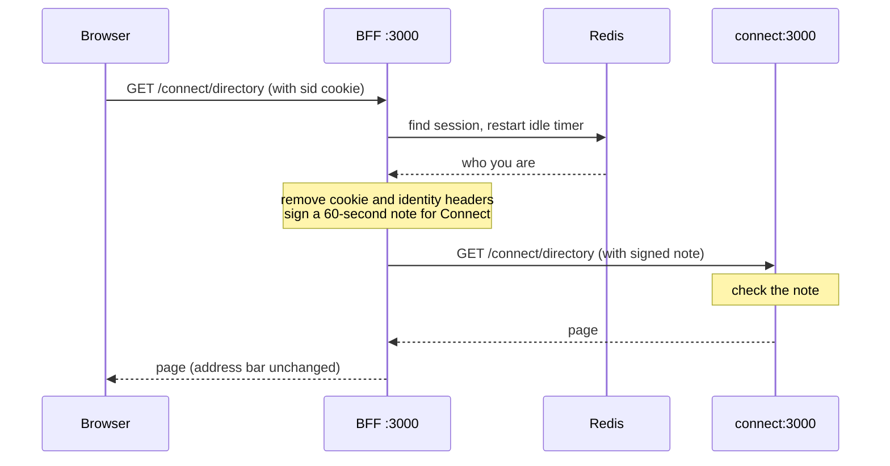

# BFF demo walkthrough

A guided tour of this repo: what a backend-for-frontend is, how this one works, and what it does and doesn't protect against. Every snippet is taken from the code, with a link to its file. §19 walks through the running app step by step. For the longer reasoning behind the design, see [architecture.mdx](./architecture.mdx).

---

## 1. What a BFF is

A BFF is a small server between the browser and everything else. It signs the user in and holds the credentials. The browser gets a cookie, never a token.

---

## 2. Why not MSAL React

**The SPA model, fairly.** Vite builds static files. MSAL.js signs in with Microsoft, keeps tokens in browser storage, and attaches them to API calls. No server to run. For many internal tools, that's the right call.

**The tradeoff.** Any script on the page can read that storage: an XSS bug, or a compromised dependency. It can copy the token and replay it from elsewhere until it expires.

**What a BFF changes.** XSS can still act as the user while the page is open. What goes away is a credential to steal and reuse. The blast radius shrinks; XSS is not solved.

**Also:** no CORS config, no refresh logic in the client, one place to audit. And it's immune to third-party-cookie blocking, which breaks MSAL's hidden-iframe renewal.

| | Vite SPA + MSAL | BFF (this repo) |
| --- | --- | --- |
| Where tokens live | Browser storage, readable by any script | Server side; browser holds an opaque `HttpOnly` cookie |
| XSS impact | Token copied and replayed from anywhere | Acts as the user while the page is open; nothing portable |
| Renewal | In the browser, needs third-party cookies | Server side |
| CORS | Required | None |
| Revocation | Wait for token expiry | Delete the session |
| Infrastructure | Static hosting | 4 containers + Redis |
| Ops burden | Very low | Patching, scaling, health checks |

---

## 3. The cookie: the core mechanic

[apps/bff/lib/cookies.ts:4-18](../apps/bff/lib/cookies.ts#L4-L18)
```ts
 
function baseOptions() {
  return {
    httpOnly: true,
    sameSite: 'lax' as const,
    path: '/',
    secure: isProduction(),
  };
}
```

Production emits `__Host-sid=…; Path=/; HttpOnly; Secure; SameSite=lax`. Local dev runs over HTTP, so it's `sid` without `Secure`.

| Attribute | What it does |
| --- | --- |
| `HttpOnly` | JavaScript can't read it; `document.cookie` won't show it |
| `Secure` | Only sent over HTTPS (set when `NODE_ENV=production`) |
| `SameSite=Lax` | Not sent on cross-site POSTs or embedded requests; blunts CSRF |
| `Path=/` | Sent to every path, so every zone |
| `__Host-` prefix | Browser rejects it unless Secure, `Path=/`, no `Domain`; subdomains can't shadow it |

The value is not a token and not a JWT. It's 32 random bytes:

[apps/bff/lib/session.ts:8-11](../apps/bff/lib/session.ts#L8-L11)
```ts
/** 32 bytes of CSPRNG output, base64url encoded — 43 opaque characters. */
export function newSessionId(): string {
  return randomBytes(32).toString('base64url');
}
```

Think of it as a coat-check ticket: it tells you nothing about the coat, and it's worthless once the cloakroom gives the coat away.

**One cookie for all three sub-apps:** the browser only ever talks to one origin, so there's one cookie jar. The proxy strips the cookie before forwarding:

[apps/bff/lib/proxy.ts:29-30](../apps/bff/lib/proxy.ts#L29-L30)
```ts
  // Sub-apps must not see the BFF session cookie. Identity arrives one way only.
  'cookie',
```


*DevTools → Application → Cookies after signing in: a single `sid` cookie with HttpOnly ticked. Local Storage and Session Storage are both empty.*

---

## 4. Behind the scenes: the reverse proxy

A **reverse proxy** is a server that takes a request, passes it on to another server, and hands the answer back. The browser never knows a second server was involved.

Here, the BFF is the proxy. When you open `/connect`, the BFF passes the request to the Connect app, which runs in its own container.

**Why not just a config setting?** Next.js can forward URLs with a `rewrites` setting in `next.config.js`. That isn't enough here. Before forwarding, the BFF has to check who you are and attach a signed note saying so, and a rewrite can't do that. The config file explains this:

[apps/bff/next.config.js:14-17](../apps/bff/next.config.js#L14-L17)
```js
 * Declarative rewrites can't do the one thing this proxy exists for: look the
 * caller's session up in Redis and attach a freshly minted, per-request
 * assertion. Middleware can add headers ahead of a rewrite, but middleware runs
 * on the Edge runtime in Next 14, where ioredis can't run.
```

So the forwarding is written as ordinary code in `app/connect/[[...path]]/route.ts`. The `[[...path]]` folder name means "match `/connect` and every page below it".

### What happens when you open `/connect/directory`

Connect has no `/directory` page yet, so the last step returns "not found". Every other step is the same for any Connect page.

1. **The browser sends the request** and automatically includes the `sid` cookie.
2. **The BFF runs quick safety checks.** It adds security headers and makes sure the request isn't a forged form submission from another site. A normal page load passes.
3. **The BFF hands the request to the proxy code** (`proxyToSubApp`).
4. **The BFF looks up your session.** It uses the cookie to find your session in Redis. It checks that you signed in less than 8 hours ago, then restarts the 30-minute inactivity timer. If there's no session, a page load is sent to the sign-in page and a data request gets a 401 ("not signed in") error.
5. **The BFF removes what it shouldn't pass on.** That's your cookie, plus any header claiming to say who you are, such as `X-User-Email`. Without this, anyone could fake their identity by sending that header themselves.
6. **The BFF writes a signed note about you.** It's a small JWT (a piece of JSON with a signature) holding your id, email, name and roles. It's addressed to Connect only and expires after 60 seconds. It travels in the `X-Internal-Assertion` header.
7. **The BFF sends the request on** to `http://connect:3000/connect/directory`. That address only exists inside the Docker network.
8. **Connect checks the note before doing anything else.** Is the signature valid? Did the BFF issue it? Is it addressed to Connect? Has it expired? If any answer is wrong, Connect replies 401.
9. **The BFF passes Connect's answer back to the browser.** It drops any cookies Connect tried to set, because only the BFF sets cookies.

Steps 5 and 6 in code:

[apps/bff/lib/proxy.ts:77-91](../apps/bff/lib/proxy.ts#L77-L91)
```ts
  const headers = stripUntrustedHeaders(req.headers);
  for (const name of REQUEST_HEADERS_TO_DROP) headers.delete(name);

  const assertion = await mintInternalAssertion({
    secret: internalJwtSecret(),
    issuer: internalJwtIssuer(),
    ttlSeconds: internalJwtTtlSeconds(),
    audience,
    subject: session.userId,
    email: session.email,
    name: session.name,
    roles: session.roles,
  });

  headers.set(INTERNAL_ASSERTION_HEADER, assertion);
```

The same flow as a diagram:



### Forwarding is not redirecting

A redirect tells the browser "go to this other address instead". A proxy fetches the page for the browser, behind the scenes.

| | Address bar | Can the browser see Connect's real address? | Sites the browser talks to |
| --- | --- | --- | --- |
| **Redirect** | Changes | Yes, and it must be reachable from the internet | Two |
| **Proxy** (this repo) | Stays the same | No; `connect:3000` stays inside the server | One |

Talking to only one site keeps things simple: one cookie, and no cross-site settings to get wrong.

### Connect must know it lives under `/connect`

Connect's config says that every page and file it serves starts with `/connect`:

[apps/connect/next.config.js:7-9](../apps/connect/next.config.js#L7-L9)
```js
  // Every route and asset is served under this prefix, which is also the path
  // the BFF proxies. Nothing has to be rewritten in between.
  basePath: '/connect',
```

Without this, Connect's pages would ask for their JavaScript and CSS at `/_next/static/…`. That address doesn't start with `/connect`, so the BFF wouldn't send it to Connect, and the page would load without its scripts and styles.

---

## 5. Redis: what it is and why it's here

Redis is an in-memory key-value store where each key can expire. Here it's the session store.

[packages/internal-auth/src/types.ts:7-16](../packages/internal-auth/src/types.ts#L7-L16)
```ts
export interface SessionRecord {
  userId: string;
  email: string;
  name: string;
  roles: string[];
  /** Epoch milliseconds. Fixed at login; drives the absolute session cap. */
  createdAt: number;
  /** Epoch milliseconds. Bumped on every request; drives the idle timeout. */
  lastSeenAt: number;
}
```

The record stays server-side, so the user can't tamper with it and one `DEL` revokes it. Every request resets the 30 min idle window, and there's a hard 8 h cap from login:

[apps/bff/lib/session.ts:65-73](../apps/bff/lib/session.ts#L65-L73)
```ts
  const now = Date.now();
  if (now - record.createdAt > sessionAbsoluteSeconds() * 1000) {
    await redis.del(keyFor(sid));
    return null;
  }

  record.lastSeenAt = now;
  await redis.set(keyFor(sid), JSON.stringify(record), 'EX', sessionIdleSeconds());
  return record;
```

**Single point of failure:** if Redis is down, nobody is signed in. A few-second in-process cache in `touchSession` would save round trips, but sign-out would lag by that long.

---

## 6. Token expiry and refresh

**Not built.** The BFF keeps the ID token's claims and discards the tokens:

[apps/bff/lib/auth/oidc.ts:153-163](../apps/bff/lib/auth/oidc.ts#L153-L163)
```ts
      const claims = tokenSet.claims();

      // Belt and braces on top of the library's own checks.
      if (claims.aud !== clientId && !(Array.isArray(claims.aud) && claims.aud.includes(clientId))) {
        return fail('ID token audience mismatch.', 401);
      }

      const user = sessionFrom(claims);
      if (!user) return fail('ID token is missing sub or an email claim.', 401);

      const sid = await rotateSessionOnLogin(readSessionId(req), user);
```

The design, once the BFF calls APIs as the user:
- **Expiry (~1 h):** store the access and refresh tokens in Redis and refresh server-side before expiry. The browser sees nothing.
- **Rotation:** Entra issues a new refresh token each time. Write it before using the new access token.
- **Concurrency:** allow one refresh per session at a time, or parallel requests stampede the token endpoint.
- **Refresh fails or the 8 h cap hits:** delete the session and redirect to login.
- **In an MSAL SPA,** all of this runs in the browser and depends on third-party cookies.

---

## 7. Sign-out across all tabs

**Server:** one `DEL` kills the session for every tab and every zone.

[apps/bff/app/api/auth/logout/route.ts:34-37](../apps/bff/app/api/auth/logout/route.ts#L34-L37)
```ts
  // DEL sess:<sid>. From this point the session id is meaningless: any request
  // that still carries the cookie will fail to resolve and be treated as signed
  // out, including requests already in flight from other tabs.
  await destroySession(sid);
```

**UX:** `BroadcastChannel`. All zones share the origin, so every tab hears it.

[packages/session-sync/src/use-logout.ts:15-19](../packages/session-sync/src/use-logout.ts#L15-L19)
```ts
  try {
    const channel = new BroadcastChannel(SESSION_CHANNEL);
    const message: SessionLogoutMessage = { type: 'logout', at: Date.now() };
    channel.postMessage(message);
    channel.close();
```

[packages/session-sync/src/session-sync.tsx:35-44](../packages/session-sync/src/session-sync.tsx#L35-L44)
```ts
    channel.onmessage = (event: MessageEvent<unknown>) => {
      if (!isLogoutMessage(event.data)) return;

      // Already on the confirmation page — redirecting again would loop.
      if (window.location.pathname === LOGGED_OUT_PATH) return;

      // replace(), not assign(): the page behind us belongs to a session that
      // no longer exists, so it should not be reachable with the back button.
      window.location.replace(LOGGED_OUT_PATH);
    };
```

**`Clear-Site-Data: "cache", "cookies", "storage"`** goes on the logout response only.

**It can't reach:** other browsers, other devices, other origins. Their sessions time out on their own.

**External SPA:** the BFF redirects to Entra's `end_session_endpoint`:

[apps/bff/lib/auth/oidc.ts:184-189](../apps/bff/lib/auth/oidc.ts#L184-L189)
```ts
      const client = await getClient();

      // `post_logout_redirect_uri` has to be registered on the app
      // registration, exactly as sent, or Entra drops the user on its own page
      // instead of bringing them back here.
      return client.endSessionUrl({ post_logout_redirect_uri: loggedOut });
```

Entra's front-channel logout loads each app's logout URL in a third-party iframe, so it's best-effort.

---

## 8. Seamless login to the legacy Vite + MSAL React app

**Neither the SPA nor the link to it is in this repo,** so there are no snippets; this is the contract.

- **Why it works:** signing in through the BFF left an Entra session cookie on `login.microsoftonline.com`.
- **Our side:** append `?login_hint=<email>` to the link's href, e.g. in `SUB_APPS` in [page.tsx](../apps/bff/app/page.tsx#L5-L9). One line.
- **Their side:** `ssoSilent` → `loginRedirect({ prompt: 'none' })` → plain `loginRedirect`.
- **`ssoSilent` usually fails now,** because it relies on a third-party iframe. The `prompt: 'none'` redirect is the reliable path: a fast bounce, still no prompt.
- **Never put a token in a URL:** URLs leak into history, logs and `Referer`.
- **Caveat:** that SPA still keeps its tokens in browser storage. SSO makes it more convenient, not more secure.

---

## 9. Security: what helmet.js does, and what this adds

[apps/bff/middleware.ts:51-56](../apps/bff/middleware.ts#L51-L56)
```ts
function applySecurityHeaders(headers: Headers): void {
  headers.set('x-content-type-options', 'nosniff');
  headers.set('referrer-policy', 'strict-origin-when-cross-origin');
  headers.set('x-frame-options', 'DENY');
  headers.set('permissions-policy', 'camera=(), microphone=(), geolocation=()');
}
```

| Header | Attack it stops |
| --- | --- |
| CSP with nonce | Injected scripts running |
| `frame-ancestors 'none'` | Clickjacking |
| `nosniff` | A text file being run as script |
| `Referrer-Policy` | Full URLs leaking to other sites |
| `Permissions-Policy` | Scripts requesting the camera, microphone or location |

[apps/bff/middleware.ts:80-91](../apps/bff/middleware.ts#L80-L91)
```ts
  const nonce = generateNonce();
  const csp = contentSecurityPolicy(nonce, process.env.NODE_ENV !== 'production');

  // Next reads the nonce back off the request's CSP header and stamps it onto
  // the script tags it generates, so this request header is load-bearing.
  const requestHeaders = new Headers(req.headers);
  requestHeaders.set('x-nonce', nonce);
  requestHeaders.set('content-security-policy', csp);

  const res = NextResponse.next({ request: { headers: requestHeaders } });
  res.headers.set('content-security-policy', csp);
  applySecurityHeaders(res.headers);
```

**The nonce flow:**
1. A random value is generated for each request.
2. It's sent in the CSP header.
3. Next stamps it on the script tags it renders.
4. The browser blocks any script without it.

**Why no `'unsafe-inline'`:** on its own it would let injected inline scripts run. Production lists it only as a fallback for old browsers; browsers that support nonces ignore it.

**Why per-request:** a fixed nonce appears in every page, so an attacker can copy it onto their own script.

**What helmet doesn't give you:**
- No tokens in the browser, and an opaque session id.
- Identity headers stripped before proxying.
- A signed 60 s assertion.
- Sub-apps unreachable from outside (§12).
- An `Origin`/`Sec-Fetch-Site` CSRF check.
- An allowlist for redirects after login.

[apps/bff/lib/csrf.ts:24-27](../apps/bff/lib/csrf.ts#L24-L27)
```ts
  // Sent by every current browser; the cheapest and most reliable signal.
  const fetchSite = req.headers.get('sec-fetch-site');
  if (fetchSite === 'same-origin') return true;
  if (fetchSite !== null) return false;
```

[apps/bff/lib/redirects.ts:8-13](../apps/bff/lib/redirects.ts#L8-L13)
```ts
export function safeReturnTo(candidate: string | null | undefined, fallback = '/'): string {
  if (!candidate) return fallback;
  if (!candidate.startsWith('/')) return fallback;
  if (candidate.startsWith('//')) return fallback;
  if (candidate.startsWith('/\\')) return fallback;
  return candidate;
```

**A limit worth knowing:** CSP doesn't stop a compromised dependency that your own build loads.

---

## 10. Shared header: reusable components

The component is [packages/ui/src/app-header.tsx](../packages/ui/src/app-header.tsx). Here it is used from a sub-app layout:

[apps/connect/app/layout.tsx:19-27](../apps/connect/app/layout.tsx#L19-L27)
```tsx
  const result = await verifyRequestIdentity(headers());
  const user = result.ok ? { name: result.identity.name, email: result.identity.email } : null;

  return (
    <html lang="en">
      <body>
        {/* Renders nothing. Follows a sign-out that happened in another tab. */}
        <SessionSync />
        <AppHeader currentZone="connect" user={user} />
```

The wiring:

[package.json:6-9](../package.json#L6-L9)
```json
  "workspaces": [
    "apps/*",
    "packages/*"
  ],
```

[packages/ui/package.json:6-7](../packages/ui/package.json#L6-L7)
```json
  "main": "./src/index.ts",
  "types": "./src/index.ts",
```

[apps/connect/next.config.js:10](../apps/connect/next.config.js#L10)
```js
  transpilePackages: ['@bff/internal-auth', '@bff/session-sync', '@internal/ui'],
```

**Gotchas:**
1. **Cross-zone links must be `<a>`, not `<Link>`.** A client-side navigation never reaches the BFF, so no assertion is minted.

[packages/ui/src/nav-link.tsx:36-49](../packages/ui/src/nav-link.tsx#L36-L49)
```tsx
export function NavLink({ targetZone, currentZone, href, className, children }: NavLinkProps) {
  if (targetZone === currentZone) {
    return (
      <Link href={href} className={className}>
        {children}
      </Link>
    );
  }

  return (
    <a href={href} className={className}>
      {children}
    </a>
  );
```

2. **Active state comes from `currentZone`, not `usePathname()`.** `basePath` is stripped before the router sees the URL, so `/connect/teams` reads as `/teams`.
3. **Tailwind content glob.** This repo has no Tailwind yet. If you add it, each app's `content` must include `../../packages/ui/src/**/*.{ts,tsx}`, or production purges the header's classes.

**The pattern for more components:** add the file under `packages/ui/src` and export it from `index.ts`. Data comes in as props; components don't fetch.

---

## 11. Adding an API route inside a Next.js app

`apps/connect/app/api/entitlements/route.ts` serves `/api/entitlements` inside Connect. `basePath` turns that into `/connect/api/entitlements`.

[apps/connect/app/api/entitlements/route.ts:6-10](../apps/connect/app/api/entitlements/route.ts#L6-L10)
```ts
/**
 * Node, not edge. `lib/entitlements` uses axios and a module-level Map; the
 * edge runtime gives neither a stable process to cache in nor node's http stack.
 */
export const runtime = 'nodejs';
```

The same rule applies to Redis and `node:crypto`: Edge can't load them.

[apps/connect/app/api/entitlements/route.ts:31-43](../apps/connect/app/api/entitlements/route.ts#L31-L43)
```ts
  const result = await verifyRequestIdentity(headers());

  if (!result.ok) {
    // Flat 401, no reason. A caller probing this endpoint learns that it was
    // rejected and nothing more.
    console.warn(`[connect] entitlements rejected: ${result.reason}`);
    return NextResponse.json({ error: 'unauthorized' }, { status: 401 });
  }

  // Identity comes from the verified claims and only from there. No reading a
  // userId out of a query parameter, a body, or an X-User-* header — those are
  // all caller-controlled, which is the whole reason the assertion exists.
  const entitlements = await getEntitlements(result.claims);
```

The axios branch is written but not wired to a real service:

[apps/connect/lib/entitlements.ts:143-149](../apps/connect/lib/entitlements.ts#L143-L149)
```ts
  client = axios.create({
    baseURL,
    timeout: API_TIMEOUT_MS,
    headers: { accept: 'application/json' },
    // Resolve on any status so retry logic below decides, not a thrown error.
    validateStatus: () => true,
  });
```

**The rule:** outbound calls run server-side, so tokens and credentials never reach the browser.

---

## 12. Docker Compose networks

[docker-compose.yml:150-157](../docker-compose.yml#L150-L157)
```yaml
networks:
  edge:
    driver: bridge
  internal:
    driver: bridge
    # No route off the host. Redis and the sub-apps have no reason to reach the
    # internet, and nothing on the internet has a reason to reach them.
    internal: true
```

[docker-compose.yml:24-29](../docker-compose.yml#L24-L29)
```yaml
x-subapp: &subapp
  restart: unless-stopped
  expose:
    - '3000'
  networks:
    - internal
```

- **`edge`** is a normal bridge network. It carries the published port and outbound traffic to Entra.
- **`internal: true`** means there's no route on or off the host.
- **Only `bff`** is on `edge` and has `ports:`, so it's the only service reachable from the host.
- **Sub-apps and Redis** use `expose` with no `ports`. They aren't just unadvertised; they're unreachable.
- **Defence in depth:** even with a bug in the assertion check, there's no route in from outside to exploit it.
- **Side effect:** the sub-apps can't call out either.

---

## 13. Dockerfile, explained

[apps/handbook/Dockerfile:110](../apps/handbook/Dockerfile#L110)
```dockerfile
COPY --from=builder --chown=node:node /app/apps/handbook/.next/standalone ./
```

| Part | What it does |
| --- | --- |
| `--from=builder` | Copies from the build stage, which is then discarded |
| `--chown=node:node` | Sets the non-root owner in the same step; a later `chown -R` would duplicate every file into another layer |
| `.next/standalone` | Next's self-contained server with only the dependencies it traces, so the image is small and has no toolchain |

In a workspace repo, the standalone entry lands at `apps/<name>/server.js`:

[apps/handbook/Dockerfile:121](../apps/handbook/Dockerfile#L121)
```dockerfile
CMD ["node", "apps/handbook/server.js"]
```

[apps/handbook/Dockerfile:104-107](../apps/handbook/Dockerfile#L104-L107)
```dockerfile
FROM base AS runner
ENV NODE_ENV=production \
    PORT=3000 \
    HOSTNAME=0.0.0.0
```

**`HOSTNAME=0.0.0.0`:** Node binds to localhost, which inside a container means only that container. `0.0.0.0` opens it to other containers and the published port. This is the most common cause of "it works locally but the container doesn't respond."

The healthcheck lives in the compose file:

[docker-compose.prod.yml:143-151](../docker-compose.prod.yml#L143-L151)
```yaml
      test:
        - CMD
        - node
        - -e
        - "require('http').get('http://127.0.0.1:3000/api/health',r=>process.exit(r.statusCode===200?0:1)).on('error',()=>process.exit(1))"
      interval: 15s
      timeout: 3s
      retries: 3
      start_period: 20s # grace period while the app boots
```

[apps/bff/app/api/health/route.ts:6-10](../apps/bff/app/api/health/route.ts#L6-L10)
```ts
/**
 * Liveness only. Touches no Redis, no upstream, no session — a failing
 * dependency must not take the container out of rotation, and a health check
 * must never be the thing that opens a Redis connection.
 */
```

**Why it doesn't check Redis or Entra:** a check that did would mark every replica unhealthy during a short outage, and they would all restart at once.

| Field | Effect |
| --- | --- |
| `interval` | How often the probe runs |
| `timeout` | How long before one probe counts as failed |
| `retries` | Consecutive failures before the container is unhealthy |
| `start_period` | Boot window in which failures don't count |

---

## 14. The X-Forwarded-Proto TODO

[docker-compose.prod.yml:28-29](../docker-compose.prod.yml#L28-L29)
```yaml
# Still TODO before going live: HTTPS. Put a load balancer in front of this
# and have it send the header X-Forwarded-Proto: https.
```

Locally the app runs over plain HTTP, so `Secure` and HSTS are never exercised.

**In production,** a load balancer terminates TLS and forwards plain HTTP. The app concludes the connection is insecure, and many stacks then drop the `Secure` cookie. Login appears to work, then the session vanishes.

**In this repo,** `Secure` follows `NODE_ENV`, so the cookie survives. The breakage shows up as `http://` redirects instead, and the proxy overwrites the forwarded protocol:

[apps/bff/lib/proxy.ts:92-94](../apps/bff/lib/proxy.ts#L92-L94)
```ts
  // Let the sub-app build absolute URLs that point back at the BFF, not at itself.
  headers.set('x-forwarded-host', req.headers.get('host') ?? req.nextUrl.host);
  headers.set('x-forwarded-proto', req.nextUrl.protocol.replace(':', ''));
```

**Fix:**
- Set `PUBLIC_ORIGIN` for each environment and derive cookie attributes from it.
- Trust `X-Forwarded-Proto` only when your own ingress sets it.
- Never trust `Host`. `publicOrigin()` falls back to it when `PUBLIC_ORIGIN` is unset.

---

## 15. Environment secrets

**Local:** `.env` is gitignored; `.env.example` is committed with the secrets blank. Without Entra credentials, `AUTH_MODE=stub` offers three fake users. The `.env` files never enter the Docker build:

[.dockerignore:8-11](../.dockerignore#L8-L11)
```
.env
.env.local
.env.*.local
.env.production
```

[docker-compose.prod.yml:35-37](../docker-compose.prod.yml#L35-L37)
```yaml
  # The `:?` means: if this value is missing, refuse to start.
  # Better to fail loudly than to silently run with a dev secret.
  INTERNAL_JWT_SECRET: ${INTERNAL_JWT_SECRET:?set INTERNAL_JWT_SECRET in .env.production}
```

**Azure** (not in this repo): Key Vault plus a system-assigned managed identity, referenced via `secretRef`. No secrets in the image, the pipeline or env files.

**Never bake a secret into a layer.** `docker history` shows it.

**Prefer a certificate for Entra.** Client secrets expire and break production without warning.

[apps/bff/lib/auth/oidc.ts:39-40](../apps/bff/lib/auth/oidc.ts#L39-L40)
```ts
        // Swap for 'private_key_jwt' when moving to a certificate credential.
        token_endpoint_auth_method: 'client_secret_post',
```

| Secret | Local | Azure |
| --- | --- | --- |
| `INTERNAL_JWT_SECRET` | `.env` | Key Vault → `secretRef` (bff + 3 sub-apps) |
| `AZURE_CLIENT_SECRET` → certificate | `.env` | Key Vault certificate |
| `REDIS_PASSWORD` / `REDIS_URL` | none (dev Redis has no password) | Key Vault, or Entra auth to managed Redis |
| `AZURE_TENANT_ID`, `AZURE_CLIENT_ID` | `.env` | Plain env vars (identifiers, not secrets) |

---

## 16. Deployment and why containers

There's no infrastructure code in the repo; this is the target. **Azure Container Apps:** `bff` on external ingress, the three sub-apps on internal ingress, and managed Redis. The compose file maps almost 1:1.

- **Why containers:** four services need a private network with three of them unreachable. Compose also gives local/prod parity, and images are portable.
- **Why not AKS:** four containers and no platform team. ACA is Kubernetes underneath without the operational surface.
- **Why not App Service:** internal-only networking is awkward there.
- **Costs:** base-image patching, image size driving cold start, and more pipeline to maintain.

---

## 17. Linux vs Windows containers

**This is Linux only.** The base images are `node:22-alpine` for the sub-apps and `node:22-slim` for the BFF, not `node:20-alpine`. The BFF is on Debian because Alpine's DNS resolver breaks Entra discovery ([Dockerfile](../apps/bff/Dockerfile#L8-L22)).

- **ACA is Linux-only.**
- **Windows containers** exist on AKS and ACI, but they're larger, slower to start, and pointless for Node.
- **No change needed:** Node is cross-platform; the container isn't.

---

## 18. SSR and SEO, with the caveats

**Vite SPA:** blank HTML → download JS → execute → fetch → paint. **Here:** the HTML arrives already populated.

**Hydration:** React attaches event handlers to the server's HTML instead of rebuilding it.

**Server components** run only on the server; their code never ships to the browser.

[apps/handbook/app/page.tsx:8-12](../apps/handbook/app/page.tsx#L8-L12)
```tsx
// Who is calling? Only the BFF's signed assertion decides — never a cookie or
// an X-User-* header, which the caller could fake. The middleware already
// checked it; checking again is cheap and keeps this page safe on its own.
export default async function HandbookPage() {
  const result = await verifyRequestIdentity(headers());
```

**SEO:** connect, iif and handbook are behind auth and will never be crawled. SEO only matters if a public zone is added.

**Performance:** faster FCP and TTI, smaller bundles, data fetched next to the data, and streaming.

**Costs:** you now run a server, cold starts exist, and an interactive dashboard behind a login gains little.

---

## 19. Walkthrough: seeing it run

**Before you start:**
- Set `AUTH_MODE=oidc` and the `AZURE_*` values in `.env`.
- In the Entra app registration, register `http://localhost:3000/api/auth/callback` as a redirect URI and `http://localhost:3000/api/auth/logged-out` as a post-logout redirect URI.
- Run `docker compose up --build` once. The first build takes a few minutes.
- Add the Entra object ids of the accounts you'll use to [`MOCK_ENTITLEMENTS`](../apps/connect/lib/entitlements.ts#L102). The map is keyed by seeded ids, so any other account gets zero permissions.
- To compare two users, sign in as the second account in a separate browser profile.
- Step 7 needs the legacy SPA running, with the `login_hint` link added (§8).

| # | What to do | What you'll see | Why it matters |
| --- | --- | --- | --- |
| 1 | `docker compose up`, then `docker compose ps` | Only `bff` has a published port | Four containers, one way in |
| 2 | Open `localhost:3000` → **Sign in** → Microsoft → back | A round trip through Microsoft sign-in | The token exchange happens server to server |
| 3 | DevTools → Cookies and Local/Session Storage; run `document.cookie` in the console | One HttpOnly `sid`, empty storage, and `""` | Page scripts can't see the session id, let alone a token |
| 4 | Header links: Connect → IIF → Handbook | Handbook's *Verified caller* card: audience `handbook`, 60 s expiry. Reloading changes the JWT id | Separate containers, no re-login, a fresh assertion per request |
| 5 | On Connect, click **GET /connect/api/entitlements**; repeat in the other browser profile | Different `permissions` for each user | Identity comes from the verified assertion, not from the browser |
| 6 | `docker compose logs -f connect` | `entitlements: <oid> -> 2 permissions (mock, fresh)` | The request went browser → BFF → connect. The assertion itself is never logged |
| 6b | `docker compose exec bff node -e "fetch('http://connect:3000/connect',{headers:{'x-user-email':'ceo@example.com'}}).then(r=>console.log(r.status))"` | `401`, and the log line `rejected GET /connect: missing assertion` | A forged identity header gets nothing, and the sub-app is only reachable from inside the network |
| 7 | Click the legacy SPA link | A brief flash of `login.microsoftonline.com`, then signed in | No prompt; the `prompt=none` redirect did the work |
| 8 | Open `/connect` and `/handbook` in two tabs, then **Sign out** in one | The other tab moves to the signed-out page | One Redis `DEL` ends the session; the broadcast just updates the other tabs |

Do step 7 before step 8. Signing out also ends the Microsoft session, which the SPA sign-in depends on. Entra may show an account picker during sign-out, because no `id_token_hint` is sent.


