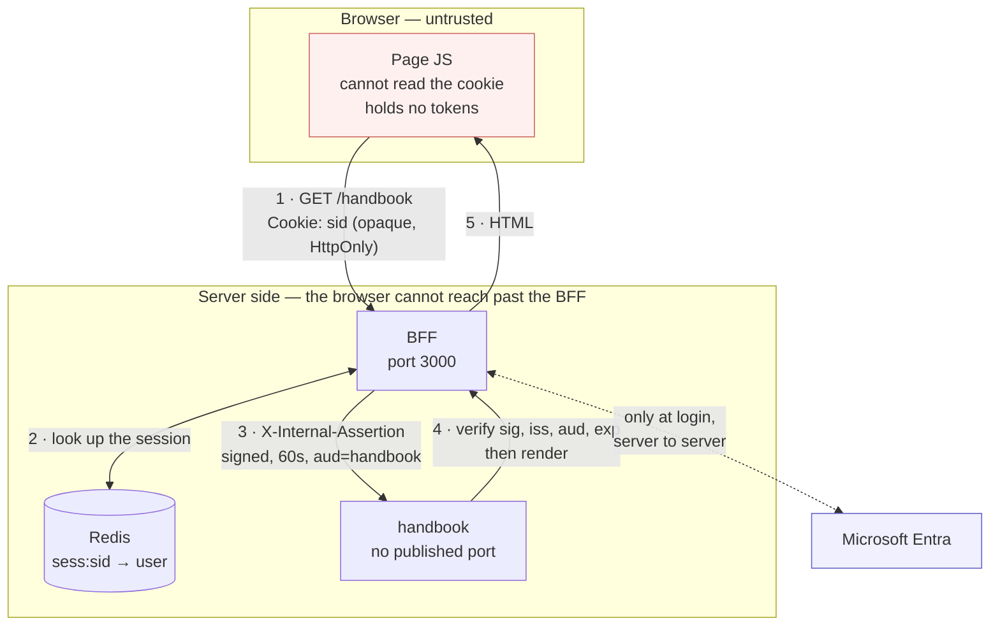

# Why this is built the way it is

This document explains the two architectural decisions behind this repo — using
a **backend-for-frontend** instead of a browser-based login, and using
**Next.js** instead of a Vite single-page app — and what each one costs.

It assumes you know React. It does not assume you know OIDC, SSR, or what a BFF
is. Terms are defined as they come up.

The goal is that you finish this understanding the tradeoffs. Both of the
alternatives described here are reasonable choices in the right context, and
this document tries to say when.

---

## a) Why a BFF instead of a Vite SPA with MSAL in the browser

### The standard approach, described fairly

The most common way to add Microsoft login to a React app looks like this:

1. You build with Vite. The output is static files — HTML, JS, CSS — that you
   drop on a CDN or a storage bucket. There is no server.
2. You add **MSAL.js** (Microsoft's browser authentication library). When the
   user clicks "sign in", MSAL redirects them to Microsoft, they authenticate,
   and Microsoft redirects them back to your app with a code.
3. MSAL exchanges that code for tokens — an **ID token** (a signed statement of
   who the user is) and an **access token** (a signed permission slip for
   calling an API). MSAL stores them in `sessionStorage` or `localStorage`.
4. When your app calls your API, it reads the access token back out of storage
   and sends it as an `Authorization: Bearer <token>` header.
5. Tokens expire after an hour or so. MSAL renews them quietly in the
   background, usually via a hidden iframe pointed at Microsoft.

**This is a genuinely good architecture for a lot of applications.** It is
simpler than what's in this repo by a wide margin. There is no server to deploy,
patch, monitor, scale, or pay for. Static hosting is close to free and close to
unbreakable. MSAL is well-maintained and widely used. For an internal tool with
a modest user base and low-sensitivity data, this is often the right call, and
choosing it is not a mistake.

### The tradeoff

Steps 3 and 4 are the issue: the tokens are in browser storage, which means they
are readable by **any JavaScript running on the page**.

That includes JavaScript you didn't write. A cross-site scripting (XSS) bug
anywhere on the page will do it — an unescaped string rendered as HTML, a
`dangerouslySetInnerHTML` with user content in it. So will a supply-chain
compromise: one of your dependencies, or one of *their* dependencies, ships a
malicious version. A typical React app has hundreds of transitive packages, and
every one of them runs with full access to `localStorage`.

If that happens, the attacker doesn't just get to act inside the user's browser.
They get to **copy the token out** and use it from anywhere — their own machine,
their own network — for as long as the token is valid. If a refresh token is
also in storage, "as long as it's valid" can mean weeks.

### What a BFF changes, precisely

Move the tokens to a server the browser can't read from. The browser gets only
an opaque session cookie, marked `HttpOnly` so JavaScript cannot read it at all.

Here is the precise claim, because this is routinely overstated:

> **A BFF does not prevent XSS, and it does not stop an attacker from acting as
> the user.** If an attacker runs script on your page, the browser will attach
> the session cookie to any request that script makes to your origin. The
> attacker can read and write whatever the user can, for as long as the user has
> the page open.
>
> **What it prevents is theft of a portable credential.** There is nothing in the
> browser to steal. The attacker cannot extract something and replay it later,
> from a different machine, after the user has closed the tab. The attack is
> confined to the page, the session, and the window of time the user is actually
> there.

That is a narrower benefit than "solves XSS", and it is still a substantial one.
It's the difference between an incident scoped to a session and an incident where
credentials walked out the door. It does not reduce your obligation to prevent
XSS in the first place.

### Four smaller reasons that add up

**No CORS configuration.** In the SPA model, your app is on one origin and your
API is on another, so every request is cross-origin and needs a CORS policy —
allowed origins, allowed headers, preflight handling, credentials mode. CORS
misconfiguration is a common source of real vulnerabilities, usually because
someone loosened it to unblock a deploy. Here, everything the browser talks to is
on `localhost:3000`. Same origin. There is no CORS policy to get wrong, and
`Access-Control-Allow-Origin` appears nowhere in this codebase.

**No token refresh logic in the client.** MSAL's renewal — checking expiry,
handling races between concurrent requests, recovering from a failed renewal,
falling back to a full redirect — is a meaningful amount of client complexity
that's awkward to test and fails in ways users experience as random logouts.
Here, the server manages the session and the client has no concept of expiry at
all. It gets a 401 or a redirect, which it already had to handle anyway.

**One place to audit.** Every decision about identity happens in `apps/bff`.
When you want to know how sessions expire, or what claims reach a sub-app, you
read one directory. In the SPA model that logic is spread across client code,
API middleware, and library configuration.

**Silent renewal is breaking anyway.** MSAL's background token renewal
historically worked by loading a hidden iframe pointed at Microsoft, which relied
on the browser sending Microsoft's cookies in a third-party context. Safari has
blocked that for years; Chrome has been restricting it. The workarounds —
refresh tokens held in JS, or full-page redirects mid-session — are each worse
than what they replaced. Server-side sessions never had this problem, because the
session lives in a first-party cookie on your own origin.

### The request flow

The dotted line is the only time a real token exists, and it never crosses into
the browser box. Steps 1–5 are walked through in detail in the
[README](../README.md#following-one-request-end-to-end).

### What happens when you sign out

Sign-out is where the difference between a server session and a browser-held
token is easiest to see, so it's worth walking through.

**What dies immediately, server-side.** Pressing "Sign out" POSTs to
`/api/auth/logout`, which deletes the `sess:<sid>` key from Redis. That is the
whole of the security story, and it is instant and total. The cookie in your
browser is now a key to a lock that no longer exists. Every subsequent request
that carries it — from this tab, from a tab you forgot about, from your phone,
from a request that was already in flight when you clicked — fails to resolve a
session and is treated as signed out. There is no window during which a copy of
the cookie still works, because the cookie was never the credential; the Redis
record was.

Three things happen alongside it, and none of them are load-bearing:

- The cookie is cleared with `Max-Age=0` and the exact same `Path`, `SameSite`
  and `Secure` attributes it was written with. A mismatch on any of those and
  the browser keeps the original.
- The response carries `Clear-Site-Data: "cache", "cookies", "storage"`, which
  asks the browser to drop its cache, its cookies, and localStorage /
  sessionStorage / IndexedDB for this origin. This is sent on the logout route
  and nowhere else — on any other route it would wipe state the app needs.
- When `AUTH_MODE=oidc` and `LOGOUT_MODE=full`, the browser is then sent to
  Entra's `end_session_endpoint`. Without it, the user still has a live sign-in
  session *with Microsoft*, so clicking "sign in" again puts them straight back
  in with no prompt. The catch is that the Microsoft session is shared: ending
  it also signs them out of Teams, Outlook and every other Microsoft app in that
  browser. That's why the default, `LOGOUT_MODE=local`, leaves it alone.

**What BroadcastChannel adds.** After the server session is gone, a tab you left
open on `/handbook` is still showing a rendered page with your name on it. It
isn't a security problem — that tab can't do anything, its next request will
401 — but it is confusing, and it invites someone to keep clicking and get
errors. So before navigating, the sign-out button posts a message on a
`BroadcastChannel`, and every other tab on the origin redirects itself to the
confirmation page. The result is that all your tabs visibly sign out together.

This is cosmetic, and deliberately so. It is not what makes sign-out safe; the
`DEL` did that. If BroadcastChannel is unavailable — older Safari, some
webviews — the code no-ops and nothing breaks.

**What it cannot do.** BroadcastChannel is scoped to one origin in one browser
profile. It does not reach:

- a different browser on the same machine,
- an incognito or private window,
- the same user on a phone or a second laptop,
- a different origin.

Those sessions are *already dead server-side* — that happened at the `DEL`. What
they keep is a stale rendering until their next request. Closing that visual gap
needs the server to push an event to connected clients, which means a per-user
Redis pub/sub channel and an SSE endpoint. That isn't built; the design is
sketched in a TODO in
[`apps/bff/lib/session.ts`](../apps/bff/lib/session.ts) so it's clear where it
would go and what it would cost.

One caveat worth stating: the `DEL` revokes *that one session*. A user signed in
on three devices has three session records, and signing out on one leaves the
other two alive until their own timeouts expire. "Sign out everywhere" needs a
`user:<id>:sessions` set to delete from — also in that TODO.

**Why the SPA has to do this differently.** In the browser-token model there is
no server-side session to delete, because there is no server-side session. The
access token *is* the credential, and it's a signed bearer token — an API
validates it by checking the signature, not by looking anything up. Nothing can
be revoked, because there is nothing to revoke against.

So "logging out" of an SPA means two things, neither of them complete. MSAL
clears the tokens from browser storage, which handles the honest case of a user
who wants to sign out. And the app redirects to the identity provider's
front-channel logout endpoint, which ends the session *at the IdP* so the next
sign-in prompts for credentials. But a token that was already copied out — by
the XSS scenario at the top of this section — remains valid until it expires,
typically up to an hour, and no logout anywhere can shorten that. This is why
SPA guidance leans so hard on short token lifetimes: expiry is the only
revocation mechanism available.

That's the practical version of the tradeoff described above. Revocation in this
architecture is a `DEL` that takes effect on the next request. In the SPA
architecture it's a request to please stop using something you can't take back.

---

## b) What server-side rendering actually means

"SSR" gets used loosely. Here is the concrete difference.

### How a Vite SPA loads a page

1. The browser requests your URL and gets back an HTML file that is essentially
   empty — a `

` and a `<script>` tag.
2. It downloads the JavaScript bundle. On a real app this is hundreds of
   kilobytes after compression.
3. It parses and executes that JavaScript. React mounts and renders your
   components.
4. Your components mount, an effect fires, and *now* the browser makes its first
   data request — `fetch('/api/handbook/policies')`.
5. That request goes over the network to your API, which queries a database, and
   comes back.
6. React re-renders with the data. The user finally sees content.

The user stares at a blank page or a spinner through steps 1–5. Each step waits
on the one before it, so the delays add up rather than overlap. On a fast
connection this is fine. On a slow or high-latency one it is very noticeable.

### How this app loads a page

1. The browser requests the URL.
2. **On the server**, Next runs your components. When a component needs data, the
   server fetches it — from Redis on the same Docker network, or a database in
   the same data centre. That takes single-digit milliseconds, not a round trip
   from the user's laptop.
3. The server renders the components to HTML and sends it.
4. The browser receives HTML that **already contains the content** and paints it
   immediately.

The user sees real content on the first response. The JavaScript still
downloads, but it downloads while they are already reading.

### Hydration

The HTML that arrives is real markup, but it's inert — buttons don't do anything
yet, because no JavaScript has run. **Hydration** is the step where React loads in
the browser, walks the server-rendered DOM, and attaches event handlers to the
elements that are already there, rather than throwing them away and re-creating
them. After hydration the page is a normal React app. The catch is that React
expects what it renders on the client to match what the server produced; if they
differ — say you rendered `new Date()` on both sides — React warns about a
hydration mismatch. That's the main new failure mode SSR introduces, and it's the
one you'll actually hit.

### Server components

Next's App Router goes further. By default, a component in `app/` is a **server
component**: it runs on the server, and **its code is never sent to the browser
at all**.

That has two consequences.

It can do things a browser component can't. It can be `async` and `await` a
database query directly in the component body. Look at
[`apps/handbook/app/page.tsx`](../apps/handbook/app/page.tsx) — it awaits a
cryptographic verification inline. There is no API route, no `useEffect`, no
loading state, no client-side fetch.

And it can't do things a browser component can. No `useState`, no `useEffect`, no
`onClick` — those need a browser. When you need them, you put `'use client'` at
the top of the file, and that component (plus anything it imports) ships to the
browser as normal. [`current-user.tsx`](../apps/bff/app/current-user.tsx) is the
only such file in the BFF, because it's the only thing that needs to fetch on the
client.

The rule of thumb: keep the `'use client'` boundary as small and as far down the
tree as you can. Everything above it stays on the server and costs the user
nothing to download.

---

## c) SEO — and what it does and doesn't apply to

Server rendering is often sold on search engine optimisation. That argument is
real, but it does not apply to most of this repo, and it's worth being exact
about where it does.

### Where SSR genuinely helps crawlers

- **Content is in the first response.** Googlebot does execute JavaScript, but it
  does so on a delayed second pass with a limited budget. Other crawlers —
  Bing, and most social and chat link previewers — do far less or none. HTML
  with content in it is unambiguous to all of them.
- **Per-page metadata.** Next lets each route export its own `title`,
  `description` and canonical URL from `generateMetadata`, rendered server-side.
  An SPA has one `index.html` and has to mutate the document head after load,
  which previewers generally don't wait for.
- **Open Graph tags.** The card that appears when someone pastes a link into
  Slack or Teams is built by a bot that fetches the URL once and does not run
  JavaScript. If your OG tags are injected client-side, the card is blank.
- **Sitemaps and canonical URLs.** Straightforward with real server routes.

### Where it does not apply here

**Connect, IIF and Handbook sit behind authentication.** A crawler hitting
`/handbook` gets a redirect to the login page. It will never see the content, it
will never index it, and that is the intended behaviour. SEO is not a benefit
this application receives, and nothing in this repo is arranged to serve it.

SEO is a reason to be **on Next.js** if and when you add a public zone — a
marketing site, a careers page, public policy documents, a status page. At that
point you'd get it without changing stacks. Until then it's a latent capability,
not a current benefit. Anyone telling you this architecture improves your search
ranking is describing a different application.

---

## d) Performance, with the costs named

### What gets faster

**First contentful paint.** The browser paints as soon as HTML arrives, instead
of after downloading and executing a bundle. This is the largest and most
consistent win, and it's biggest exactly where it matters most — slow networks
and low-end devices.

**Time to interactive**, usually. Less JavaScript to parse and execute means
hydration finishes sooner. "Usually" because a page with a lot of client
components can end up shipping as much JS as the SPA would have.

**JavaScript bundle size.** Server components don't ship. Neither do the
libraries they use. A server component that formats dates with a 70 KB date
library costs the browser nothing, because neither the component nor the library
is in the bundle. In an SPA, everything on the page is in the bundle by
definition.

**Data fetching.** In an SPA, the browser fetches from your API over the public
internet — and if a page needs three things, that's often three sequential round
trips at 50–200 ms each. Here, the fetch happens on the server, next to the data.
The Redis lookup in [`session.ts`](../apps/bff/lib/session.ts) crosses a Docker
bridge network. Fetches in a server component can also run in parallel without
you orchestrating anything.

**Streaming.** The server can send HTML in pieces. Wrap a slow section in
`<Suspense>` and the rest of the page is delivered and painted while that part is
still being produced. An SPA can't stream a page it hasn't downloaded the code
for yet.

### What it costs

**You now run a server.** This is the big one. Static files on a CDN need no
patching, no scaling, no health checks, and cost almost nothing. Four Node
containers and a Redis instance need all of that. Compare against the operational
burden you're actually taking on, not against zero.

**Cold starts.** On serverless platforms, a request arriving at an idle instance
waits for Node to boot and the module graph to load. That can be hundreds of
milliseconds to a few seconds — enough to wipe out the first-paint advantage for
whoever hits it. Keeping instances warm costs money.

**Server CPU per request.** Rendering React to HTML is work, and you do it for
every request. An SPA does that work on the user's device, for free, at whatever
scale. Under load, SSR is the thing that falls over.

**Caching is harder.** A static SPA is one artifact you can cache everywhere
forever. Server-rendered pages that vary per user cannot be cached by a CDN at
all — every request in this app reaches origin. Next's caching layers are
capable, and they are also a genuine source of confusion.

**Two runtimes to reason about.** Code runs on the server, on the client, or
both. Stack traces span both. "Works locally, breaks in the container" gets more
likely, and the Edge-versus-Node distinction in this repo — described in the
[README](../README.md#two-deliberate-deviations) — is exactly that kind of
complexity.

**Some apps just don't benefit.** A heavily interactive dashboard behind a login,
which users open once in the morning and leave open all day, has almost no
first-paint pressure. Everything after the first render is client-side anyway.
For that app, SSR adds infrastructure and returns very little. Be honest about
which one you're building.

---

## e) Shared UI

`packages/ui` (`@internal/ui`) holds the header every zone renders. It is
small on purpose — the interesting part is not the component, it is what a
shared package has to do to survive a standalone production build.

### Why the package ships untranspiled

There is no build step. `main` and `types` both point straight at
`./src/index.ts`, and consumers name the package in `transpilePackages` so
Next compiles the TSX in place, with the consuming app's own Babel/SWC
settings.

The alternative is a `tsup`/`rollup` step emitting `dist/`. That buys nothing
here and costs plenty: a second compiler to configure, a build ordering
constraint between packages and apps, stale `dist/` output whenever someone
edits source without rebuilding, and source maps that point at generated code.
Shipping source means editing `packages/ui/src` hot-reloads in every app that
has it bind-mounted, and there is exactly one compiler in the repo.

The cost is real but narrow: anything importing this package must be able to
compile TSX, which is why every app lists it in `transpilePackages`. A plain
`node` process could not `require` it.

### Why cross-zone links are anchors

`NavLink` renders `next/link` when `targetZone === currentZone`, and a plain
`<a>` otherwise.

Each zone is a separate Next application, in a separate container, with its own
router, its own build manifest and its own basePath. A client-side transition
from `/connect` to `/iif` asks the *Connect* router for a route it has never
heard of. The RSC fetch resolves against the wrong basePath and 404s — and
even if it somehow resolved, the BFF would never see a document request, so it
would never mint an assertion for IIF and the destination would reject the
caller.

A full document request is therefore the feature, not a regression: it goes
through the BFF, which reads the session and mints the assertion the
destination requires. `prefetch={false}` does not help; the problem is the
client-side navigation itself, not the prefetch.

For the same family of reasons, active state comes from the `currentZone` prop
and never from `usePathname()`. A sub-app strips its basePath before the router
sees the URL, so Connect serving `/connect/teams` reports `/teams`. Matching
that against `/connect` fails, and the header lights up the wrong tab or none.
The rendering app is the only thing that reliably knows which zone it is.

### The three things that break a standalone build

Each of these fails in the same maddening way: fine in `next dev`, broken in
the container.

**1. Missing `transpilePackages`.** Dev is forgiving; the production build is
not. Without the app naming `@internal/ui`, the build tries to consume raw TSX
from `node_modules` and dies on the first `<` it reads — `Module parse failed:
Unexpected token`.

**2. Missing tracing includes.** `output: 'standalone'` copies only what the
file tracer proves is reachable. A workspace package consumed as source is
inlined into the compiled output, so nothing in the trace points back at
`packages/ui`, and the directory is left out of the runner image. The app then
builds cleanly and crashes at container start with `Cannot find module
'@internal/ui'`. Naming it in `experimental.outputFileTracingIncludes` is what
puts it in the image.

Note that both tracing options live under `experimental` in Next 14. A
top-level `outputFileTracingRoot` is accepted by the config object and then
silently ignored — Next reads `config.experimental.outputFileTracingRoot`.
Nothing warns you. It appears to work anyway, because when the option is unset
Next walks up to the workspace root and infers it.

**3. Wrong `CMD` path.** With `outputFileTracingRoot` at the monorepo root, the
standalone output reproduces the repo layout: the entry point is
`apps/<name>/server.js`, not `./server.js`. A Dockerfile that copies standalone
to the image root and runs `node server.js` exits immediately with `Cannot
find module '/app/server.js'`.

A fourth, less famous one: the `deps` stage must copy `packages/ui/package.json`
along with every other workspace manifest. The lockfile declares the workspace,
so `npm ci` fails outright if the directory is not there.

---

## Vite SPA vs. this stack

| | Vite SPA + MSAL | Next.js BFF (this repo) |
| --- | --- | --- |
| **Where tokens live** | `localStorage` / `sessionStorage`, readable by any script on the page | Server memory and Redis; browser gets an opaque `HttpOnly` cookie |
| **XSS impact** | Attacker copies the token and replays it later from anywhere | Attacker acts as the user while the page is open; nothing portable to steal |
| **Token refresh** | Client-side, historically via hidden iframes that browsers now block | Server-side session; the client has no concept of expiry |
| **CORS** | Required — app and API are different origins | None — everything is same-origin through the BFF |
| **Infrastructure** | Static files on a CDN | 4 Node containers + Redis |
| **Ops burden** | Very low | Real: patching, scaling, health checks, cold starts |
| **First paint** | Blank until JS downloads, executes, and fetches | HTML with content in the first response |
| **JS shipped** | Everything on the page | Only client components |
| **Data fetching** | Browser → API over the internet, often sequential | Server → data source, adjacent, parallel by default |
| **Under heavy load** | Scales trivially; work happens on user devices | Origin does render work for every request |
| **Crawlable** | Poorly, without extra work | Yes — but irrelevant while everything is behind auth |
| **Debugging** | One runtime | Server, client, Edge, and Node |
| **Right when** | Internal tool, low-sensitivity data, small team, no server appetite | Sensitive data, compliance pressure, public zone likely, server already in the picture |

---

